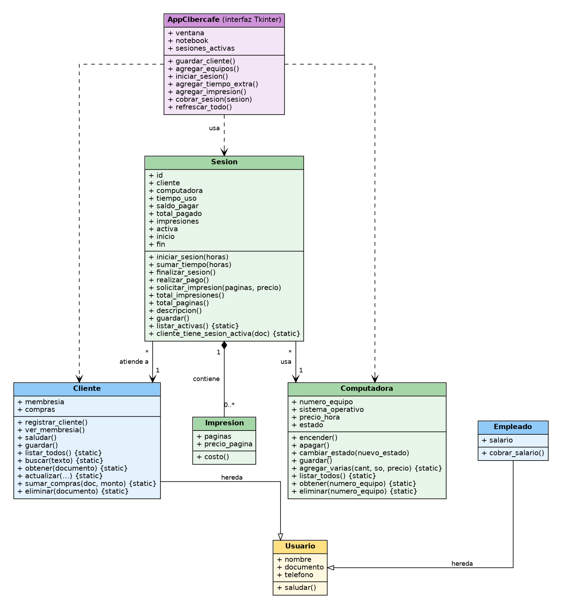
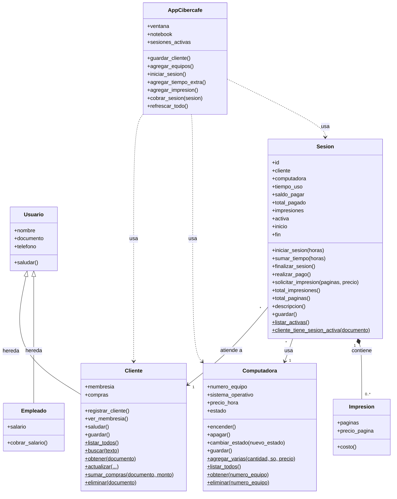

# Cibercafé - Proyecto final

Sistema de gestión para un cibercafé hecho en **Python**, con **programación orientada a objetos**, base de datos **SQLite** e **interfaz gráfica Tkinter**.

Esta entrega final reúne todo lo trabajado en los talleres anteriores en una sola aplicación que se puede usar sin escribir código: registrar clientes, buscarlos, controlar los computadores del local y llevar las sesiones con sus impresiones y tiempo extra.

---

## Cómo ejecutarlo

Requisitos: Python 3.8 o superior. Tkinter y SQLite vienen incluidos con Python (en Linux puede hacer falta `sudo apt install python3-tk`).

```bash
python ENTREGABLE_FINAL.py
```

La primera vez se crea automáticamente el archivo `cibercafe.db`. Si ya tenías ese archivo del Taller 8, **se conservan tus clientes**: el programa solo agrega las tablas nuevas.

---

## Archivos

| Archivo | Para qué sirve |
|---|---|
| `ENTREGABLE_FINAL.py` | **Entrega final**: clases, base de datos e interfaz gráfica (con comentarios explicativos) |
| `Cibercafe_proyecto_completo.py` | Archivo con todos los talleres (3 al 9) y sus ejemplos de uso; queda como registro del proceso |
| `diagrama_uml.png` | Diagrama UML de clases del proyecto |
| `cibercafe.db` | Base de datos SQLite (se genera sola al ejecutar) |

---

## Qué puede hacer la aplicación

La ventana tiene tres pestañas y una barra inferior que muestra cuántos equipos hay, cuántos están disponibles u ocupados y cuántas sesiones están activas.

### 1. Clientes
- **Crear** un cliente (documento, nombre, teléfono, membresía Regular o VIP y compras).
- **Buscar** escribiendo parte del documento o del nombre: la lista se filtra mientras se escribe.
- **Actualizar** los datos de un cliente seleccionado en la lista.
- **Eliminar** un cliente (pide confirmación y no deja borrar a alguien con una sesión activa).

### 2. Equipos
- **Agregar computadores**: se elige la cantidad, el sistema operativo y el precio por hora. Se numeran solos (`PC-01`, `PC-02`, ...), así que para registrar los 10 equipos del local basta con poner 10 y pulsar *Agregar*.
- La lista muestra el estado de cada equipo con colores: **verde = Disponible**, **rojo = Ocupada**, y el nombre del cliente que lo está usando.
- **Ocupar (iniciar sesión)** lleva a la pestaña de sesiones con el equipo ya elegido.
- **Liberar (finalizar y cobrar)** cierra la sesión del equipo seleccionado y lo deja disponible.
- **Eliminar equipo** (no permite borrar uno ocupado).

### 3. Sesiones
- **Iniciar sesión**: se elige el cliente, un equipo disponible y las horas contratadas. El equipo pasa a *Ocupada*.
- **Tiempo extra**: suma más horas a una sesión activa y el saldo se recalcula con el precio por hora del equipo.
- **Impresiones**: se registran las páginas y el precio por página (por defecto $50). Una sesión puede tener varias impresiones.
- **Detalle**: al seleccionar una sesión se ve el desglose de tiempo, impresiones y total.
- **Finalizar y cobrar**: muestra el resumen, pide confirmación, registra el pago, libera el equipo y suma el total al campo *compras* del cliente.

---

## Qué se reutilizó de cada taller

| Taller | Concepto | Dónde aparece en el proyecto final |
|---|---|---|
| Base / 3 / 4 | Clases `Cliente`, `Computadora`, `Sesion`, objetos en listas y CRUD | Las sesiones activas se cargan como una lista de objetos `Sesion`; la interfaz hace crear, leer, actualizar y borrar |
| 5 | Herencia | `Usuario` es la clase base de `Cliente` y `Empleado` |
| 6 | Polimorfismo y `__str__` | `Cliente` sobreescribe `saludar()` y define `__str__` |
| 7 | Composición | `Sesion` crea y guarda sus propias `Impresion` (una impresión no existe sin su sesión) |
| 8 | SQLite | Persistencia de clientes, computadoras, sesiones e impresiones |
| 9 | Tkinter | Interfaz completa con pestañas, tablas, formularios y mensajes |

## Diagrama UML de clases



**Cómo leerlo**

| Símbolo | Relación | En el proyecto |
|---|---|---|
| Flecha con triángulo vacío | **Herencia** | `Cliente` y `Empleado` heredan de `Usuario` (Taller 5) |
| Flecha abierta | **Asociación** | Una `Sesion` está asociada a un `Cliente` y a una `Computadora`, que existen sin la sesión |
| Línea con rombo relleno | **Composición** | Una `Sesion` contiene de 0 a muchas `Impresion`; una impresión no existe sin su sesión (Taller 7) |
| Flecha punteada | **Dependencia** | `AppCibercafe` (la interfaz) usa las clases `Cliente`, `Computadora` y `Sesion` |
| `{static}` | Método estático | Se llama con la clase, sin crear un objeto (por ejemplo `Cliente.buscar(...)`) |

**Versión en texto (Mermaid)**, para editarla o verla en GitHub y en editores que la soporten:



---

## Qué se agregó en esta entrega

**Base de datos**: además de `clientes`, ahora existen las tablas `computadoras`, `sesiones` e `impresiones`. Así, al cerrar y abrir el programa no se pierde nada: los equipos, las sesiones abiertas y sus impresiones siguen ahí.

**Clases**
- `Computadora`: ahora se guarda en SQLite y puede crearse en cantidad (`agregar_varias`).
- `Sesion`: guarda y carga sus datos (`guardar`, `listar_activas`), incluye la fecha de inicio y fin, y conserva el total pagado como historial.
- `Cliente`: nuevos métodos `buscar`, `obtener` y `sumar_compras`.

**Interfaz**
- Validación de los datos (números positivos, campos obligatorios) con mensajes claros en pantalla.
- Confirmación antes de eliminar o cobrar.
- Reglas para evitar inconsistencias: un equipo ocupado no se puede eliminar y un cliente con sesión activa tampoco.

**Corrección respecto al Taller 9**: antes, guardar un documento repetido mostraba «Cliente guardado» aunque no se guardara, porque `guardar()` atrapaba el error internamente. Ahora la interfaz revisa primero si el documento ya existe y avisa correctamente.

---

## Cómo se manejan los estados de los equipos

El estado de un computador **cambia solo según las sesiones**, para que nunca queden datos contradictorios:

- Al iniciar una sesión, el equipo pasa a **Ocupada**.
- Al finalizar y cobrar, vuelve a **Disponible**.

Por eso los botones *Ocupar* y *Liberar* de la pestaña Equipos usan el mismo proceso de las sesiones en lugar de cambiar el estado a mano.

---

## Estructura de la base de datos

```
clientes      (documento PK, nombre, telefono, membresia, compras)
computadoras  (numero_equipo PK, sistema_operativo, precio_hora, estado)
sesiones      (id PK, documento, numero_equipo, tiempo_uso, saldo_pagar,
               total_pagado, activa, inicio, fin)
impresiones   (id PK, sesion_id, paginas, precio_pagina)
```

---

## Posibles mejoras futuras

- Pestaña de historial y reporte de ventas por día.
- Descuentos según la membresía (por ejemplo VIP).
- Módulo de empleados con la clase `Empleado`, que ya existe pero todavía no tiene pantalla.
- Cronómetro que sume el tiempo automáticamente en lugar de indicarlo en horas.
