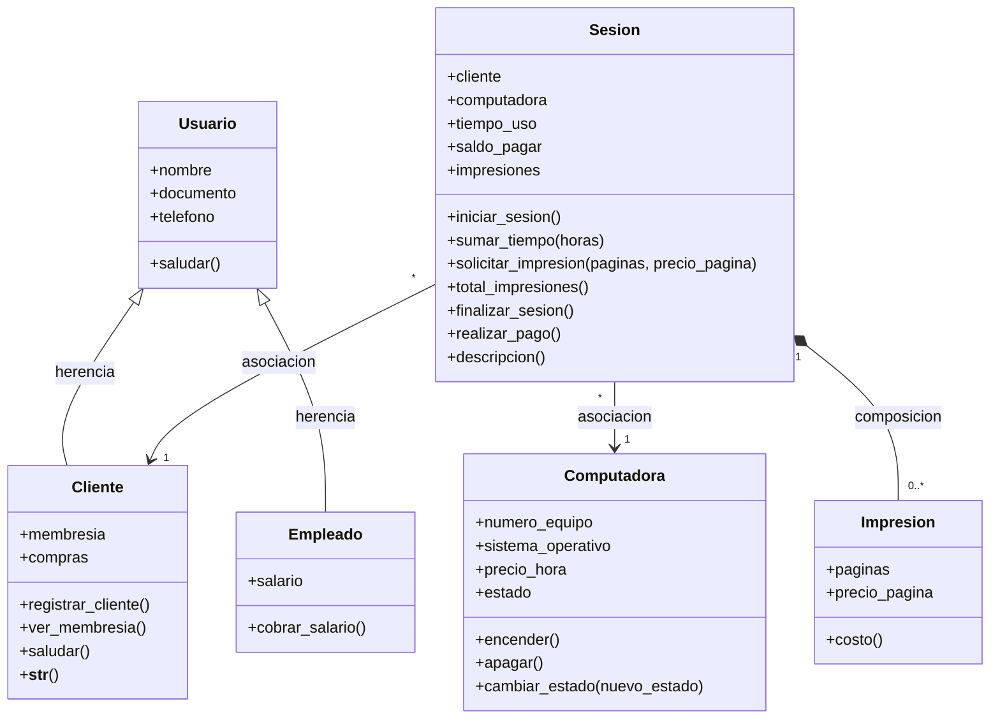

# Cibercafé — Proyecto de Programación Orientada a Objetos

## Negocio

**Cibercafé**: un local que renta computadoras por hora, ofrece servicio de impresión y atiende clientes que llegan a usar los equipos.

## Problema que resuelve

Llevar el control de clientes, computadoras disponibles, tiempo de uso y pagos de forma manual (papel o memoria) genera errores y pérdida de información. Este proyecto modela esas entidades como clases en Python para organizar y automatizar esa información a lo largo de distintos talleres, aplicando los conceptos de la Programación Orientada a Objetos.

---

## Estructura del repositorio

| Archivo | Contenido |
|---|---|
| `cibercafe_v2.py` | **Proyecto principal** — integra todos los talleres en un solo programa funcional. |
| `taller3.py` | Taller 3 en versión simple (lista de `Cliente`) — ejercicio independiente. |
| `taller3_sesion.py` | Taller 3 usando `Sesion` en vez de `Cliente` — versión independiente. |
| `taller4.py` | Taller 4 (CRUD) como archivo independiente, fuera del proyecto principal. |
| `taller5.py` | Taller 5 (herencia) como archivo independiente. |
| `taller6.py` | Taller 6 (CRUD de Clientes + polimorfismo) como archivo independiente. |
| `diagrama_uml.mermaid` | Diagrama de clases UML completo (Taller 7). |

> Nota: `taller3.py`, `taller4.py`, `taller5.py` y `taller6.py` son versiones aisladas de cada ejercicio, pensadas para entregarse por separado. **`cibercafe_v2.py`** es la versión "oficial" del negocio, donde todo vive integrado y conectado.

---

## Evolución del proyecto por taller

### Taller 1 — De mi negocio a objetos
Se identificaron las clases del negocio: `Cliente`, `Computadora`, `Impresión`, `Empleado`, `Pago`, con sus atributos y métodos en papel (sin código todavía).

### Taller 2 — Tu primera clase en Python
Se programó la clase `Cliente` con `__init__` y un método (`registrar_cliente`).

### Taller 3 — Tus objetos en una lista
Se crearon al menos 3 objetos, se guardaron en una lista con `.append()` y se recorrieron con un `for`, mostrando cada uno con un método `descripcion()`.

### Taller 4 — Tu primer CRUD
Se detectó un problema de diseño: `tiempo_uso` y `saldo_pagar` no pertenecen al `Cliente` (un dato fijo), sino a una **Sesión** (una visita puntual). Se creó la clase `Sesion` y sobre su lista se implementó el CRUD completo:
- **Create:** se agregan nuevas sesiones con `.append()`.
- **Read:** se recorre la lista con un `for` y `descripcion()`.
- **Update:** se busca una sesión por número de equipo y se le suma tiempo (`sumar_tiempo()`).
- **Delete:** se elimina una sesión de la lista con `.remove()`.
La lista se imprime después de cada operación para ver el efecto.

### Taller 5 — La jerarquía de tu proyecto
Se creó la clase base `Usuario` (nombre, documento, teléfono, `saludar()`), de la cual heredan:
- `Cliente` — atributo propio `membresia`, método propio `ver_membresia()`.
- `Empleado` — atributo propio `salario`, método propio `cobrar_salario()`.

Ambas subclases usan `super().__init__(...)` para reutilizar el constructor de `Usuario`.

### Taller 6 — CRUD de Clientes + Polimorfismo
Se le agregó a `Cliente`:
- Un método `__str__` para mostrarlo directamente con `print()`.
- Un atributo `compras`.
- Una **sobreescritura** del método `saludar()` heredado de `Usuario` (polimorfismo): un `Cliente` saluda mencionando su membresía, mientras que `Empleado` conserva el saludo genérico de `Usuario`.

Sobre una lista de clientes se implementó el CRUD completo (crear, leer con `__str__`, actualizar sus compras, borrar uno) y se demostró el polimorfismo recorriendo una lista mixta `[Cliente, Empleado]` donde cada objeto ejecuta su propia versión de `saludar()`.

### Taller 7 — Relaciones entre clases
Se identificaron tres relaciones reales del negocio.

| Relación | Tipo | Justificación |
|---|---|---|
| `Sesion` → `Cliente` | Asociación | El cliente existe aunque no tenga sesiones. |
| `Sesion` → `Computadora` | Asociación | La computadora existe aunque nadie la use. |
| `Sesion` ◆— `Impresion` | **Composición** | Una impresión no existe sin su sesión: la `Sesion` la crea y la guarda en su lista `impresiones`. |

Implementación: se creó la clase `Impresion` (`paginas`, `precio_pagina`, `costo()`) y en `Sesion` se agregaron la lista `impresiones` y los métodos `solicitar_impresion()` (crea la impresión y suma su costo al saldo) y `total_impresiones()`.

---

## Diagrama de clases UML

El diagrama completo (clases, herencia del Taller 5 y las relaciones del Taller 7) está en `diagrama_uml.mermaid`:



---

## Jerarquía de clases (proyecto principal)

```
Usuario (clase base)
├── Cliente   (membresia, compras, ver_membresia(), saludar() sobreescrito, __str__)
└── Empleado  (salario, cobrar_salario())

Computadora   (numero_equipo, sistema_operativo, precio_hora, estado)

Sesion        (cliente, computadora, tiempo_uso, saldo_pagar, impresiones,
               iniciar_sesion(), sumar_tiempo(), solicitar_impresion(),
               total_impresiones(), finalizar_sesion(), realizar_pago(),
               descripcion())
  └── Impresion  (paginas, precio_pagina, costo())   <- composición
```

## Cómo ejecutar

```bash
python3 cibercafe_v2.py
```

Esto corre, en orden, el flujo completo: registro y sesiones del Taller 2, la lista de sesiones del Taller 3, el CRUD de sesiones del Taller 4, la jerarquía de herencia del Taller 5, el CRUD de clientes con polimorfismo del Taller 6, y la composición Sesion–Impresion del Taller 7.

Cada taller también puede probarse por separado ejecutando su archivo individual, por ejemplo:

```bash
python3 taller6.py
```